## Hi there, I'm hooray804! 👋

### 👨‍💻 About Me
> I'm currently focusing on my studies, so I might be offline during weekdays. I'll check all notifications and issues over the weekend!

I am a high school student and continue to serve as the administrator for my middle school's website server.

### 🚀 Technical Skills

| Category | Tech Stack |
| :--- | :--- |
| **Mobile** |  |
| **Web** |   |

---

### 🛠 Main Projects

#### [Picky](https://github.com/hooray804/Picky)
* A userscript featuring a web element inspector and an ad block rule generator.
* Features intelligent CSS selector generation, permanent element zapping.
* Optimized for mobile environments.

#### [AdGuard Gallery Filter](https://github.com/hooray804/adguard-gallery-filter)
* Adblock filter list: Focused on removing ads with a specialization in the Korean language (Maintained via Fork).

#### [Octopus](https://github.com/hooray804/octopus)
* Developing specialized scripts to bypass anti adblockers and enhance web accessibility.

---

### 🔭 Current Focus
- **AI-Powered Adblocker:** Exploring AI based intelligent content filtering.
- **Swift Frameworks:** Deepening knowledge in modern iOS development.

